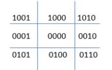
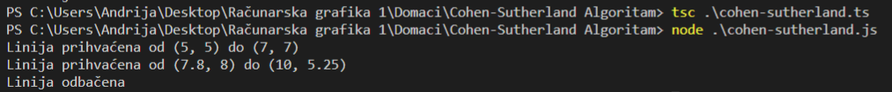

# Cohen-Sutherland algoritam odsecanja linija

Prozor odsecanja (clipping window) je regularan pravougaonik.

U osnovi ovog algoritma su Cohen-ovi kodovi:

Prozor odsecanja biće `0000`.

Cohen-ovi kodovi imaju sledeće značenje:

- Levo = 1 = `0001`,
- Desno = 2 = `0010`,
- Dole = 4 = `0100`,
- Gore = 8 = `1000`,

Na osnovu ovoga, zaključujemo da je, na primer, gore_levo = 8 + 1 = 9 = `1001`.

Nas interesuje region `0000` a ovaj algoritam vrši odsecanje svih linija koje su van njega.

*Napomena:* postoji nekoliko varijanti ovih kodova i u pitanju su samo okreti za 90 stepeni u smislu šta je "gore", "dole", "levo", "desno" u odnosu na prozor odsecanja.

Koraci algoritma:

1. Za svaku krajnju tačku (endpoint) linije, odredi `regionalni kod` (region code);
2. Linija se *trivijalno* prihvata ukoliko obe kranje tačke imaju kod `0000`;
3. U suprotnom, primeni logičko `AND` nad kodovima tačaka;
   - Ukoliko rezultat nije `0000`, *trivijalno* odbaci liniju (ovo znači da je linija cela u istom regionu, a taj region nije naš prozor odsecanja);
   - U suprotnom, odsecanje je neophodno:
      - Bira se krajnja tačka linije koja je van prozora odsecanja;
      - Nalazi se presečna tačka linije sa okvirom prozora odsecanja;
      - Kranja tačka linije, koja je van prozora se menja presečnom tačkom iz prethodnog koraka;
      - Ponovi korak 2.
4. Ponovi korak 1 za preostale linije.

Implementacija ovog algoritma se nalazi u [`cohen-sutherland.ts`](cohen-sutherland.ts) fajlu.

Primer rada:

Uzmimo da je prozor odsecanja pravougaonik sa donjom levom tačkom u (4, 4) i gornjom desnom tačkom u (10, 8).

Neka su linije koje želimo da odsečemo (x1, y1, x2, y2):

- (5, 5, 7, 7);
- (7, 9, 11, 4);
- (1, 5, 4, 1);

Rezultat ovog algoritma je:

