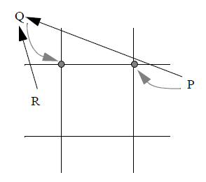

# Maillot algoritam odsecanja poligona

_Novi, brzi, metod odsecanja 2D poligona - Patrick-Gilles Maillot_

Osnovan na Cohen-Sutherland algoritmu odsecanja linija.

Performanse:

- Do 8x brži od Sutherland-Hodgman algoritma
- Do 3x brži od Liang-Barsky algoritma

Cohen-Sutherland algoritam odsecanja ivica se koristi zato što je jedan od najefikasnijih metoda za trivijalno prihvatanje/odbacivanje linija (najfrekventniji slučajevi u vizualizaciji).

Algoritam se može implementirati koristeći bilo cele, bilo realne brojeve.

## Principi algoritma

Osnovna ideja je da se iskoriste informacije koje generiše Cohen-Sutherland algoritam odsecanja linija.

Maillot-ov algoritam ne pretpostavlja orijentaciju regiona odsecanja, niti poligona, ne zahteva sortiranje i može biti deo pipeline implementacije.

Sva temena poligona će prolaziti dodatan osnovni test okretnice `basic turning point test`. U većini slučajeva, ovaj test ima 'cenu' jednobitnog testa.

Cilj je da se generišu tačke okretnica samo kada je segmen delimično, ili potpuno, odbačen od strane algoritma odsecanja linija.

Cohen-Sutherland algoritam odsecanja linija je opisan [ovde](../Cohen-Sutherland/OPIS.md).

### Koncepti algoritma

Cohen-Sutherland je zadužen za računanje regionalnih kodova (Cohen-ovi kodovi).

1. Odredi regionalni kod prve tačke poligona
2. Za sve naredne tačke (u nastavku 'trenutna tačka')
   1. Odredi regionalni kod trenutne tačke
   2. Ukoliko je segment van regiona odsecanja
      1. Proveri složene slučajeve
   3. Osnovni test okretnice (`basic turning point test`)
   4. Postavi: prva tačka = trenutna tačka

## Različiti ishodi (situacije) u algoritmu

Prvi uslov je da se kodovima, koji se vraćaju prilikom testiranja krajnjih tačaka segmenta poligonove granice doda jedan bit. Taj bit govori da li originalni kod ima jedan ili dva bita. Npr.:

- Ukoliko je originalni kod `0001`, kod je ovde `00001`.
- Ukoliko je originalni kod `0110`, kod je ovde `10110`.

Segment koji počinje u regionu sa jednobitnim segmentom (0001, 0010, 0100, 1000) ćemo nazivati `1-x segment`.

Segment koji se završava u nekom od prethodnih regiona ćemo nazivati `x-1 segment`.

Analogno, imamo `2-x` i `x-2` segmente.

### Osnovni test okretnice (basic turning point test)

Ovaj test proverava da li krajnja tačka segmenta leži u uglu van prozora odsecanja i dodaje tačku okreta tačkama odsečenog poligona u zavisnosti od ishoda.

Ovo garantuje korektno odsečen poligon, kada su svi segmenti poligona bar delimično unutar prozora odsecanja a neke kranje tačke segmenata su u regionima gde je kod, izračunat Cohen-Sutherland algoritmom, dvobitan.

U idealnom slučaju, svaka ivica (linija) poligona ne bi trebalo da bude smatrana nezavisnom od prethodne ili naredne.

Na primeru slike ispod, ukoliko $i-ta$ ivica $V_iV_{i+1}$ generiše tačku okretnice, onda $i+1-va$ ivica $V_{i+1}iV_{i+2}$ ne bi trebalo da generiše istu tačku opet. Iz tog razloga, ivice treba smatrati povezanim a ovaj test vršiti nad krajnjim tačkama.


_slika 1_

### Složeniji slučajevi

Na narednoj slici su prikazane različite generičke konfiguracije za segment, u odnosu na prozor odsecanja. Sve slučajeve je moguće izvesti iz onih prikazanih simetrijom ili rotacijom.

Algoritam ne mora da 'brine' o slučajevima gde je segment delimično ili potpuno vidljiv. U ovim slučajevima, osnovni test okretnice je dovoljan za generisanje neophodne informacije za odsecanje.


_slika 2_

#### 1-1 bit slučajevi

Linije `a` i `b` sa slike iznad, slučajevi gde je linija (ivica) van prozora odsecanja a obe tačke su u 1-bitnom regionu.

Ovde imamo dva pod-slučaja:

1. Obe tačke imaju isti kod, u ovom slučaju tačka okreta ne može biti generisana (linija `a` sa slike).
2. Tačke imaju različite kodove. U ovom slučaju, dovoljna je jedna tačka okretnice. Tačka okreta će biti ugao prozora odsecanja koji odgovara `OR` operaciji kodova tih dveju tačaka i rezultuje 2-bitnim kodom (linija `b` sa slike).

#### 2-1 i 1-2 bit slučajevi

Linije `c` i `d` sa slike iznad, slučajevi gde je linija (ivica) van prozora odsecanja, jedna od tačaka u 1-bitnom a druga u 2-bitnom segmentu.

Pod-slučajevi:

1. Krajnja tačka je u 1-bitnom regionu, rezultat `AND` operacije kodova dveju tačaka nije 0, nema generisanja tačke okreta (segment $PR$ sa slike ispod). Ukoliko rezultat jeste 0 (segment $PQ$ sa slike ispod), onda se generiše tačka okreta (slučaj se rešava pomoću `look up` tabelice koja je kasnije prikazana).


_slika 3_

2. Krajnja tačka je u 2-bitnom regionu, rezultat `AND` operacije kodova dveju tačaka nije 0, onda se generiše tačka okreta (slučaj se rešava pomoću `look up` tabelice koja je kasnije prikazana) (segment $RQ$ sa slike ispod). Ukoliko rezultat jeste 0, dve tačke okreta se generišu. Prva zavisi od vrednosti regionalnih kodova tačaka a drugu generiše osnovni test okretnice (segment $PQ$ sa slike ispod).


_slika 4_

#### Generisanje 'look up' tabelice

Tabelica koja se koristi u `1-2` i `2-1` slučajevima.

Sadržaj tabelice zavisi od kodova koji se koriste za odsecanje segmenta.

Ukoliko gledamo segment $PQ$ sa slike iznad, $P$ ima kod `0001` a $Q$ `0110`, osnovni test okretnice se primenjuje korišćenjem $Q$-ovog koda za generisanje najlevlje tačke okreta. `Look up` tabelica se koristi za generisanje najdesnije tačke okreta. Cilj je da se odredi 2-bitni kod koristeći vrednosti kodova $P$ i $Q$ za generisanje validne (druge) tačke okreta.

Formula koja se koristi je:

`new_code = code[Q] + table[code[P]]`

Tabelica izgleda ovako:

```typescript
table[1] = -3;
table[2] = -6;
table[4] = 3;
table[8] = 6;
```

#### 2-2 bit slučajevi

Linije `e`, `f` i `g` sa slike 3, slučajevi gde su obe tačke u 2-bitnim segmentima.

Pod-slučajevi:

1. Obe tačke imaju isti kod, nema generisanja tačke okreta (linija `e` sa slike).
2. Ukoliko rezultat logičkog `AND` kodova tačaka nije 0, osnovni test okretnice se primenjuje nad krajnjom tačkom linije (linija `f` sa slike).
3. Ukoliko je rezultat logičkog `AND` kodova tačaka 0, neophodno je generisati dve tačke okreta. Prva se trivijalno generiše osnovnim testom okretnice. Druga tačka ima dva kandidata (slika 5). Implementacija koristi deljenje ivice na pola, sve dok se izračunata tačka ne nalazi u regionu pokrivenom ostalim slučajevima. Konačan je broj petlji kroz koje se prolazi u tom slučaju i zavisi od preciznosti na koju se cilja. U slučaju korišćenja 32-bitnih integera, biće manje od 32 petlje.


_slika 5_

Implementacija ovog algoritma se nalazi u [`maillot.ts`](maillot.ts) fajlu.

Primer rada:

Prozor odsecanja:


Poligon:


Rezultat:


