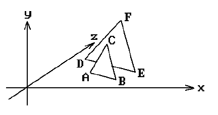
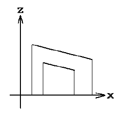
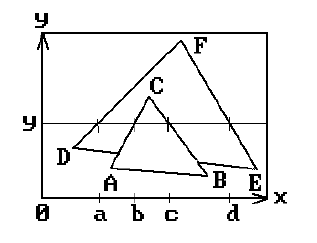
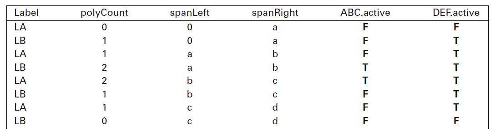
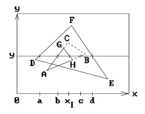
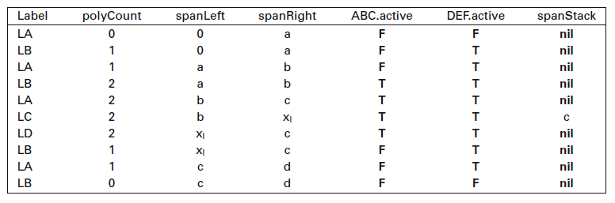

# Watkins algoritam skeniranja

## Ukratko o algoritmu

_Skeniranje se vrši s leva na desno, te se segmenti određuju (ispituju) s levog ka desnom kraju._

Watkins algoritam je algoritam skeniranja linija u prostoru slike.

Ideja je da desni kraj tekućeg raspona "lebdi" a levi kraj ostane fiksiran.

Počinje se od krajnje desne tačke. Novi segmenti se uzimaju iz x-sortirane liste a desni kraj se pomera ulevo sve dok se ne dobije raspon koji je dovoljno jednostavan da se izračuna koji segment je vidljiv.

Neophodno je obratiti pažnju na dve stavke:

- Neophodno je skratiti ivice (skan konvertovanje poligona, navedeno ispod)
- Neophodno je da je nad poligonima izvršeno odsecanje nekim od algoritama odsecanja

#### Skan konvertovanje poligona

1. Dodeli praznu _korpu_ svakoj skan liniji.
2. Nađi najveću y vrednost za svaku ivicu i stavi ivicu u korpu odgovarajuće skan linije.
3. Za svaku ivicu _e_ vodi računa o:
   1. x - inicijalno, x koordinata najviše tačke ivice e (tačka $x_e$, presečna tačka ivice e sa trenutnom skan linijom).
   2. dx - razlika u x od linije do linije, recipročno nagibu.
   3. dy - inicijalno, broj skan linija preko kojih ivica e prelazi.
4. Inicijalizuj listu aktivnih ivica kao praznu. Postavi y kao visinu skan linije koja je na vrhu.
5. Dodaj sve ivice u korpu za y u listu aktivnih ivica.
6. Za svaku ivicu u aktivnoj listi, nacrtaj (x,y), promeni x u x+dx i umanji dy. Ukoliko dy postane 0, izbaci ivicu iz liste.
7. Smanji y, ukoliko je 0, izađi; u suprotnom, vrati se na korak 5.

### Primer

Neka je scena kao na slici 1.


_slika 1_

Naredne slike prikazuju projekcije na x-z i x-y ose (tim redom).


_slika 2 (projekcija na x-z osu)_


_slika 3 (projekcija na x-y osu)_

Pretpostavimo da smo trenutno na skan liniji $y$ (slika 3). Kritične tačke duž x ose su 0, a, b, c i d.

Tabela sa slike 4 prikazuje napredak skeniranja x-a.


_slika 4_

Oznaka aktivnog poligona prelazi sa `true` na `false` na osnovu argumenta tipa parnosti.

Objekti sa slike 1 nemaju presečne tačke, na slici 5 je primer gde objekti prolaze jedan kroz drugi.


_slika 5_


_slika 6_

U ovom slučaju, moramo odrediti presečne tačke a desni kraj raspona se pomera ulevo, uz održavanje trenutnih vrednosti, dok se ne dobije segment u kom nema preseka između objekata.

Ovde je presek u tački $x_I$ (segment [b, c]). Neophodno je proveriti sve aktivne poligone naspram svih drugih aktivnih poligona.

Proveravamo z-vrednosti krajnjih tačaka raspona, neka su to $zl_1$ i $zr_1$ za prvi poligon i $zl_2$ i $zr_2$.

Postoji presečna tačka u slučaju da:

```c++
((zl1 < zl2) and (zr1 > zr2)) or ((zl1 > zl2) and (zr1 < zr2))
```

Ovo je slučaj labela $LC$ i $LD$ sa slike 6.

Čuva se vrednost $c$ na stek i obrađuje segment [$x_I$, c].

Uvek se proverava da li segmenti imaju presečne tačke u nekom od krajeva raspona. Ukoliko je tako, uzima se x vrednost naspramne krajnje tačke kako bi se proverila dubina i odredilo koji poligon je bliži.

## Opširnije o algoritmu

### Uvod

Problem vidljive površine - efikasno odrediti koje "porcije" scene su vidljive iz određene tačke gledišta.

Gary Watkins je u svojoj doktorskoj tezi prezentovao algoritam za određivanje vidljivih površina kompleksnih 3-dimenzionalnih scena. Watkins je generisao izlaz za rasterski prikaz u kome je slika pravougaoni niz piksela. Problem je ekvivalentan odlučivanju, za svaki piksel, koji od poligona je vidljiv na tom pikselu. Shvatanje da je problem dovoljno rešiti za rezoluciju ekrana je jedna od ključnih ideja u ovom algoritmu. Druga važna stvar je to što svaka skan linija može biti obrađena zasebno, ali u slučaju obrađivanja skan linija odozgo nadole, susedne linije biće prilično slične. Ovo se naziva (skan) linijska koherencija (u sceni, vidljive površine/objekti teže ka nefrekventnim promenama i to samo na diskretnim mestima).

Pretpostavimo da je scena napravljena od objekata koji su ravni (2D) poligoni u 3D okruženju i da se nijedan poligon ne seče sa drugim. Poligoni se sortiraju na osnovu skan linija (po onim na kojim se prvo pojavljuju u slici).

Watkins-ov algoritam obrađuje svaku skan liniju, održavajući listu aktivnih ivica (sortiranih po x). Kako se prolazi kroz listu, aktivni poligoni se upoređuju po z koordinatama i najviše-prednji poligon se prikazuje.

Efikasnost se postiže održavanjem liste raspona, koji su zapravo segmenti skan linije duž koje je poligon vidljiv. Ovo uprošćava soriranje po z u okviru jedne skan linije. U algoritmu se naglašava koherencija skan linija, korišćenjem iste liste uzoraka na svakoj skan liniji i pretpostavljanjem da poligoni imaju iste x i z odnose na uzastopnim skan linijama. Kada ove pretpostavke nisu ispravne, algoritam obavlja dodatan posao kako bi postavio adekvatne liste.

Pristup pomoću skan linija znači da mnoga komplikovanija izračunavanja, kao što je određivanje preseka ivice sa određenom skan linijom, mogu biti zamenjena _inkrementalnim kalkulacijama_ gde se presečna tačka određuje na osnovu prethodnog preseka i dodavanjem inverznog nagiba. Dubina i osenčenje se dobijaju na sličan način.

Algoritmi koji koriste skan linije nisu jedini pomoću kojih se rešava problem vidljivih površina. Umanjenjem cena računarskih memorija se je umnogome povećala pristupačnost rasterskih terminala i bafera okvira. Tehnike poput _z-buffer algoritma_ su, što se tiče količine izračunavanja, mnogo manje zahtevne ukoliko se implementiraju direktno u hardveru ili firmveru i zamenile su sofisticiranije algoritme vidljivih površina u nekim slučajevima. Veliki problem koji ostaje je anti-aliasing slika, pogotovu za prikaze u punim bojama.

**Aliasing** - Slike na ekranu računara se sastoje od malih pravougaonih elemenata - piksela. Ako slika predstavlja krivu, npr. krug ili dijagonalnu liniju, tada pravougaoni elementi prave nazubljen lik (jagged edge) i vide se "stepenice". Ta pojava se zove aliasing. Ona je neželjena i može se ublažiti popunom odgovarajućim pikselima, koji imaju međuboju između objekta i podloge. Taj način neutralizacije nazubljenja naziva se anti-aliasing.

Postoje dobro poznate tehnike za anti-aliasing slike određivanjem proseka svih vidljivih poligona za dat piksel (ali ne rade najbolje za z-bafer i algoritme prioriteta). Razlog je taj što ovi algoritmi prelepljuju stare vrednosti izračunatih delova ekrana, nemaju mogućnost da odrete intenzitet jednog piksela jer ne postoji trenutak u kome su svi poligoni, koji su vidljivi na tom pikselu, u procesu obrade. Algoritmi skan linija nemaju ovaj problem i lako se mogu modifikovati da generišu (anti-aliasing-ovane) prikaze, visokog kvaliteta, složenih scena.

### Kompleksnost

U algoritmu se izvode sledeće operacije:

- Rad proporcionalan broju ivica u sceni u toku x i y sortiranje na početku svakog frejma i na svakoj skan liniji gde ivica ulazi i izlazi sa scene.
- Rad proporcionalan broju poligona tokom inicijalizacije scene.
- Rad proporcionalan broju ivica na skan linijama dok se x i z vrednosti za svaku ivicu inkrementiraju od skan linije do skan linije.
- Rad proporcionalan ukupnom broju prelaza tokom održavanja liste aktivnih ivica u x-sortiranom redosledu.
- Rad proporcionalan broju vidljivih prelaza ivica prilikom određivanja novog vidljivog poligona.
- Rad proporcionalan rezoluciji ekrana prilikom inicijalizacije sortiranja i spoljne petlje skeniranja scene odozgo na dole.

Pretpostavljamo da se _vizuelna složenost_ slike definiše sumom broja ivica u sceni, rezolucije ekrana i broja vidljivih prelaza ivica.

Watkins-ov algoritam nema složenost proporcionalnu vizuelnoj složenosti.

Lista aktivnih ivica se sortira _Bubble sort_ algoritmom.

Implementacija (delimična) ovog algoritma se nalazi u [`watkins.ts`](watkins.ts) fajlu.
